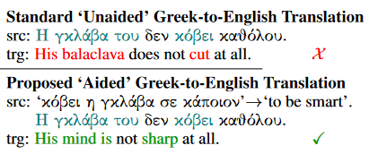

# Dictionary-Aided Translation for Handling Multi-Word Expressions in Low-Resource Languages
Multi-word expressions (MWEs) present unique challenges in natural language processing (NLP), particularly within the context of translation systems, due to their inherent scarcity, non-compositional nature, and other distinct lexical and morphosyntactic characteristics, issues that are exacerbated in low resource settings. In this study, we elucidate and attempt to address these challenges by leveraging a substantial corpus of human annotated Greek MWEs. To address the complexity of translating such phrases, we propose a novel method leveraging an available out of-context lexicon. We assess the translation capabilities of current state-of-the-art systems on this task, employing both automated metrics and human evaluators. We find that by using our method when applicable, the performance of current systems can be significantly improved. However, these models are still unable to produce translations comparable to those of a human speaker.

# Instructions
The scripts provided in the "code" directory use, and produce, the data files provided in the "data" directory.

Example usage of a script:
```
python3 human_parse_gpt.py
```

Our automatic quality estimation is built upon COMET, therefore to run it you first need to install the relevant package:
```
pip3 install unbabel-comet
```

You can then use it with the relevant data files provided, for example:
```
comet-score -s source_for_COMET_good.el -t NLLB_for_COMET_good.en GPT_unaided_for_COMET_clean.en -r GPT_aided_for_COMET_clean.en
```
